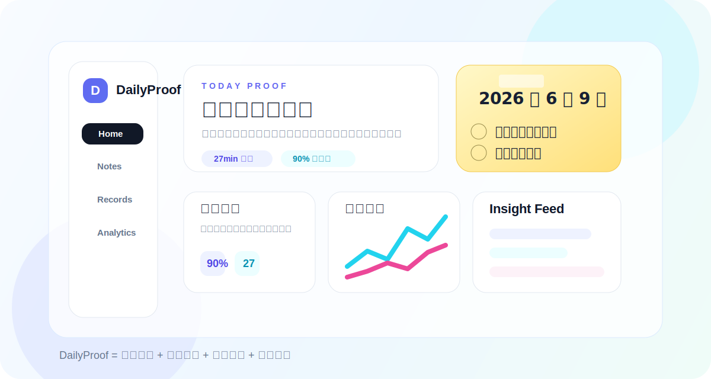
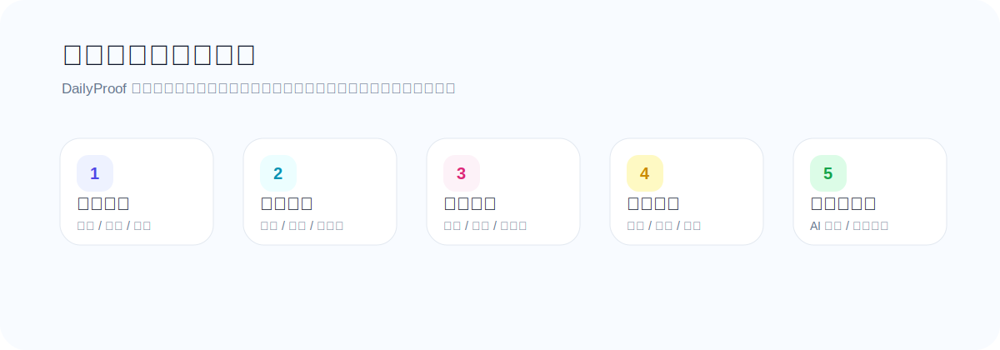
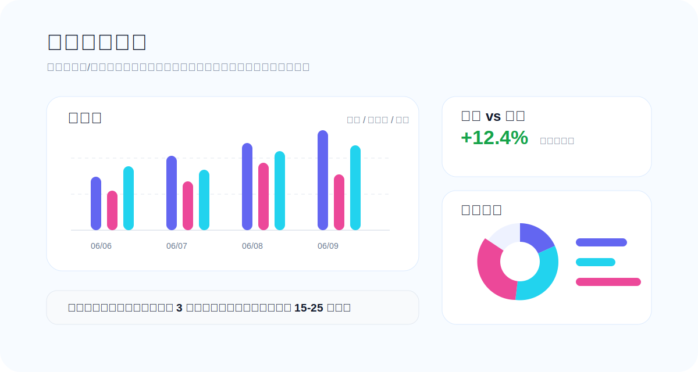

# DailyProof


DailyProof 是一个面向备考、刷题复盘和每日执行的统计系统。它把「月度目标 -> 今日任务 -> 便签清单 -> 做题记录 -> 数据洞察 -> 下一步建议」串成一个闭环，让每天的努力不只停留在感觉里，而是沉淀成可验证的数据。

[线上访问](http://www.clockwise.asia/DailyProof)



## 核心能力

| 模块 | 解决的问题 | 关键能力 |
| --- | --- | --- |
| Home / Dashboard | 今天该做什么、完成到哪里 | 月计划拆分、每日任务、倒计时、刷题结果录入 |
| Notes | 每日事项容易散、缺少回看 | 便签本清单、勾选划掉、历史便签墙、AI 当日建议 |
| Records | 做题数据分散，复盘困难 | 题量、正确数、用时、正确率、错因标签、备注 |
| Analytics | 看不出趋势和异常 | 日/周/月统计、趋势图、热力图、异常检测、洞察流 |
| Calendar | 需要按日期回看 | 日历视图、完成率、每日轨迹 |
| Admin | 管理者需要总览 | 用户进度、完成率、刷题量、平均正确率 |

## 产品闭环



1. 创建月度目标，明确目标用时、目标正确率和每日节奏。
2. 系统把目标拆成每天可执行的事项和刷题任务。
3. 当天通过倒计时、勾选和便签清单推进执行。
4. 做题后记录板块、题量、正确数、用时、错因和备注。
5. Analytics 生成趋势、对比、异常提醒和下一步建议。

## 数据统计



DailyProof 的统计重点不是堆图表，而是回答三个问题：

- 今天和最近一段时间有没有进步？
- 哪个板块正在拖后腿，正确率和用时分别发生了什么？
- 下一次练习应该优先改什么？

当前支持的刷题板块：

- 言语
- 图推
- 数量关系
- 资料分析
- 判断推理
- 政治理论
- 常识

## 技术栈

| 层级 | 技术 |
| --- | --- |
| 前端 | React 19、TypeScript、Vite、ECharts、lucide-react |
| 后端 | FastAPI、SQLAlchemy 2、Pydantic Settings |
| 数据库 | 生产 PostgreSQL，本地可用 SQLite |
| 部署 | Docker Compose、Nginx 子路径反向代理、GitHub Actions |
| AI | OpenAI-compatible `chat/completions` 接口 |

## 目录结构

```text
DailyProof
├─ backend/              # FastAPI 后端服务
├─ frontend/             # React + Vite 前端源码
├─ frontend_dist/        # 生产前端构建产物
├─ docs/                 # 架构、API、部署和 README 图片
├─ .github/workflows/    # GitHub Actions 自动部署
├─ docker-compose.yml
└─ README.md
```

## 本地运行

### 1. 构建前端

```bash
cd frontend
npm install
npm run build
cd ..
```

### 2. 启动后端

Windows PowerShell:

```powershell
$env:DATABASE_URL="sqlite:///./data/dailyproof.sqlite3"
$env:JWT_SECRET="local-dailyproof-secret"
$env:PYTHONPATH="$PWD/backend"
python -m uvicorn app.main:app --host 0.0.0.0 --port 8000
```

macOS / Linux:

```bash
export DATABASE_URL=sqlite:///./data/dailyproof.sqlite3
export JWT_SECRET=local-dailyproof-secret
export PYTHONPATH="$PWD/backend"
python -m uvicorn app.main:app --host 0.0.0.0 --port 8000
```

访问：

```text
http://localhost:8000/DailyProof
```

## Docker 部署

```bash
cp .env.example .env
docker compose up -d --build
```

默认容器监听宿主机 `8091`，Nginx 将 `/DailyProof` 反代到：

```text
http://127.0.0.1:8091
```

健康检查：

```text
/DailyProof/api/health
```

## 自动部署

仓库已配置 GitHub Actions：

- 推送到 `main` 后自动构建前端。
- 打包项目并上传到服务器。
- 在服务器执行 `docker compose up -d --build app`。
- 部署后请求健康检查和线上页面确认服务可用。

需要在 GitHub Repository Secrets 中配置至少一种 SSH 凭据：

| Secret | 说明 |
| --- | --- |
| `DAILYPROOF_SSH_KEY` | 推荐，服务器私钥 |
| `DAILYPROOF_SSH_PASSWORD` | 可选，服务器 SSH 密码 |
| `DAILYPROOF_HOST` | 可选，服务器地址 |
| `DAILYPROOF_USER` | 可选，SSH 用户 |
| `DAILYPROOF_REMOTE_DIR` | 可选，远端部署目录 |
| `DAILYPROOF_BASE_URL` | 可选，线上访问地址 |

不要把生产 `.env`、服务器密码或 API Key 提交到仓库。

## 默认账号

| 角色 | 邮箱 | 密码 |
| --- | --- | --- |
| 管理员 | `admin@dailyproof.cn` | `DailyProof@2026` |
| 体验用户 | `demo@dailyproof.cn` | `Demo@2026` |

线上环境如已修改账号或密码，以服务器当前配置为准。

## 参考文档

- [架构文档](docs/架构文档.md)
- [API 文档](docs/API文档.md)
- [设计文档](docs/设计文档.md)
- [部署文档](docs/部署文档.md)

