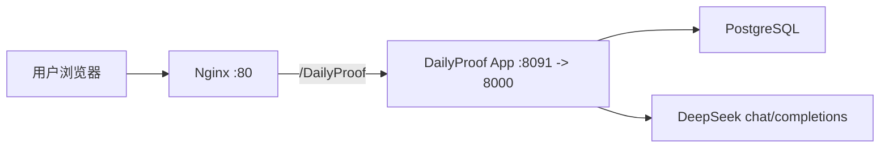

# DailyProof 架构文档

## 技术栈

- 前端：React 19、TypeScript、Vite、lucide-react
- 后端：FastAPI、SQLAlchemy 2、Pydantic Settings
- 数据库：生产 PostgreSQL 16；本地可使用 SQLite
- 部署：Docker Compose + Nginx 子路径反向代理
- 大模型：OpenAI-compatible `chat/completions`，环境变量与 PixelForge 风格一致

## 路由

- 前端入口：`/DailyProof`
- API 前缀：`/DailyProof/api`
- 健康检查：`/DailyProof/api/health`

## 数据模型

- `users`：用户、角色、密码哈希
- `monthly_plans`：月度目标、目标用时、目标正确率、原始计划文本
- `plan_template_blocks`：月计划模板块，按星期展开成日任务，包含 `task_type` 和 `practice_tag`
- `daily_plans`：某用户某日期的日计划
- `daily_tasks`：每日任务，支持事项/刷题类型、刷题标签、状态、累计秒数、计时开始时间、完成时间、刷题量、正确率、用时分钟和复盘备注
- `daily_checkins`：每日打卡心情和备注
- `questions` / `practice_sessions` / `practice_answers`：历史表，当前 UI 已移除独立刷题系统，不再作为产品入口

## 并发与性能

- 数据库连接池：生产 SQLAlchemy 使用连接池和 `pool_pre_ping`，避免僵尸连接。
- 多 worker：容器默认 `uvicorn --workers 2`，可根据服务器资源扩展。
- 数据一致性：用户每日计划有唯一约束；答题记录有唯一约束；任务状态在后端统一更新。
- 倒计时策略：前端每秒渲染，后端只记录累计秒数和开始时间，减少频繁写库；刷题完成要求写入题量、正确率和用时。
- 查询优化：常用维度如用户、日期、状态、任务类型、刷题标签有索引；统计按日、周、月和总维度聚合。
- 并发迁移：启动时轻量迁移在 PostgreSQL advisory lock 内执行，避免多 worker 重复改表。

## AI 接入

环境变量：

- `DEEPSEEK_API_URL=https://api.deepseek.com/chat/completions`
- `DEEPSEEK_API_KEY=...`
- `DEEPSEEK_MODEL=deepseek-v4-pro`

后端计划拆分调用 DeepSeek。若 key 缺失、模型不可用或接口失败，系统自动使用内置 6 月计划模板，保证创建计划流程不中断。

## 部署拓扑



## Nginx 规则

```nginx
location = /DailyProof {
    return 301 /DailyProof/;
}

location ^~ /DailyProof/ {
    proxy_pass http://127.0.0.1:8091;
    proxy_set_header Host $host;
    proxy_set_header X-Real-IP $remote_addr;
    proxy_set_header X-Forwarded-For $proxy_add_x_forwarded_for;
    proxy_set_header X-Forwarded-Proto $scheme;
    proxy_read_timeout 300s;
}
```

## 安全

- 密码使用 PBKDF2-SHA256 加盐哈希。
- 登录 Token 使用 HS256 签名并设置过期时间。
- 管理接口检查 `admin` 角色。
- 生产 `.env` 不应提交到仓库。
